# praktikum3

## lab2_latihan1
### Program sederhada dengan input 2 buah bilangan, kemudian tentukan bilangan terbesar dari kedua bilangan
Buatlah 2 variabel yang bertipe integer dengan format input agar user bisa menginput angka
Lalu buat pengkondisian if dan else
Kemudian print hasil
Berikut ini adalah source code programnya
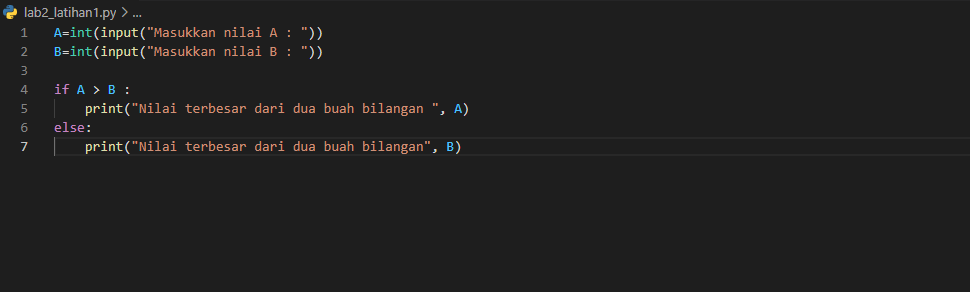
Dan ini hasil ketika programnya dijalankan
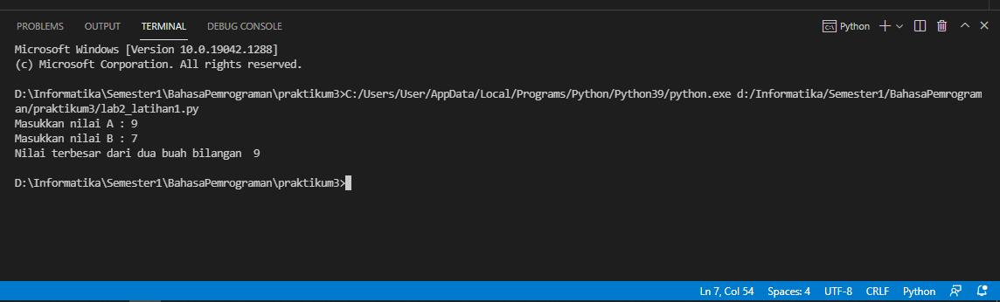

## lab2_latihan2
### Program mengurutkan data dari 3 variabel
Buatlah 3 variabel yang bertipe integer dengan format input agar user bisa menginput angka
Lalu buat variabel urut yang berisi 3 variabel tersebut
Kemudian print, gunakan 'sorted' untuk mengurutkan bilangan
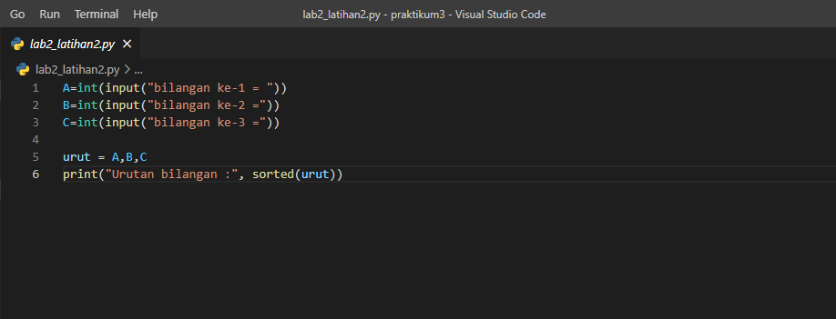
Dibawah ini contoh hasilnya
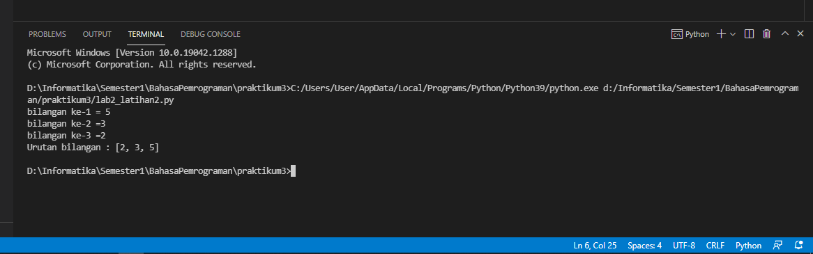

## lab3_latihan1
### program dengan perulangan bertingkat (nested) for
Buat variabel baris dan kolom
buat perulangan baris dan kolom menggunakan nested for
print hasil
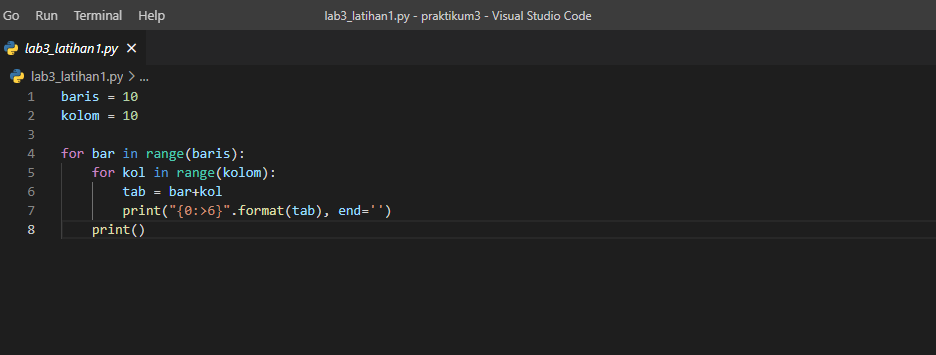
Dibawah ini hasilnya
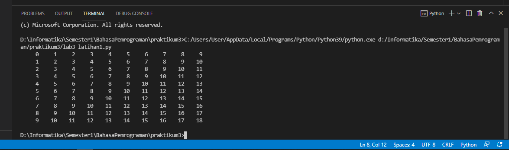

## lab3_latihan2
### Tampilkan n bilangan acak yang lebih kecil dari 0.5 nilai n diisi pada saat runtime
import random memanggil file random.
n = int(input("Masukan nilai N : ")) input variabel n, tipe data integer.
for b in range(n) : looping for index b dengan jumlah perulangan sebanyak n.
c = random.uniform(.0,.5) variabel a berisikan angka acak dari 0.0 sampai 0.5.
print(c) print data ke : a = index looping c = angka random.
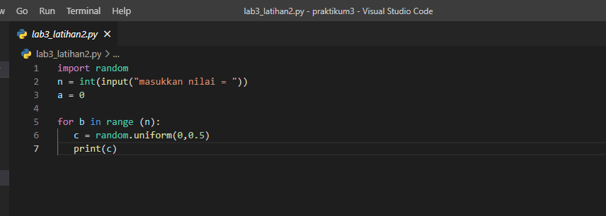
Berikut ini contoh hasilnya
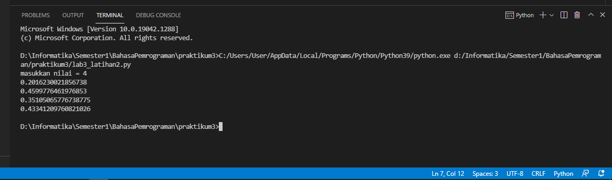

# labspy02
## Tugas
### Input 3 bilangan dan tampilkan nilai terbesarnya
#### untuk mencari bilangan terbesar dari 3 bilangan algoritmanya yang dimasukkan akan membandingkan terlebih dahulu apakah A > B.
#### jika A > B,maka ada 2 kadidat bilangan terbesar,yaitu A dan C sehingga perlu dilakukan pengujian yang lebih besar dari A dan C dengan membandingkan nilai B dan C. 
#### jika nilai B ternyata lebih besar dari C, maka bilangan terbesar adalah A.nilai terbesar adalah C jika ternyata C lebih besar dari A.
#### jika kondisi A > B tidak terpenuhui(atau B <=A),maka 2 kadidat bilangan terbesar adalah B dan C.jika nilai C ternyata lebih kecil dari A,maka B adalah nilai terbesar,sedangkan jika C yang lebih besar dari B ,maka yang terbesar adalah C.
Berikut ini adalah programnya
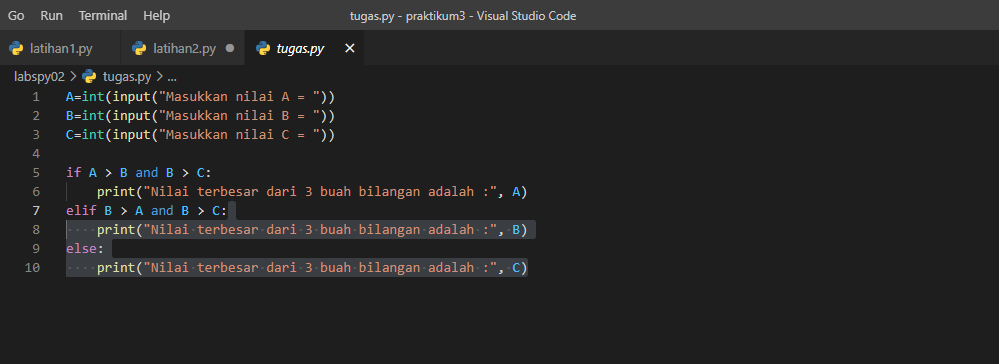
Dibawah ini adalah hcontoh hasilnya
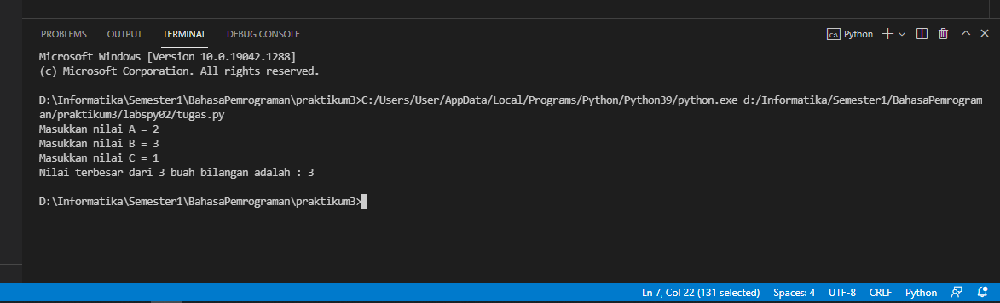
flowchart:
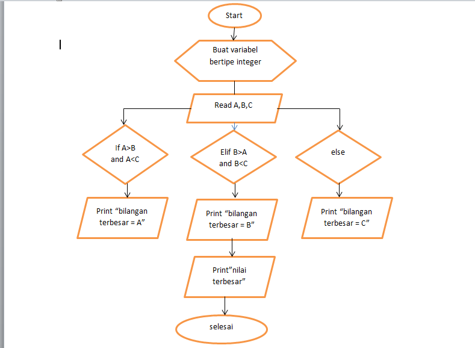

# labspy03
## latihan1
### Tampilkan n bilangan acak yang lebih kecil dari 0.5. Nilai n diisi pada saat runtime
##### import random memanggil file random.
##### n = int(input("Masukan nilai N : ")) input variabel n, tipe data integer.
##### for b in range(n) : looping for index b dengan jumlah perulangan sebanyak n.
##### c = random.uniform(.0,.5) variabel a berisikan angka acak dari 0.0 sampai 0.5.
##### print(c) print data ke : a = index looping c = angka random.
berikut ini adalah programnya:
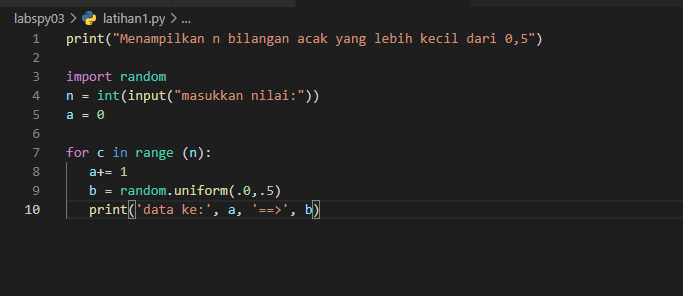
dibawah ini hasilnya:
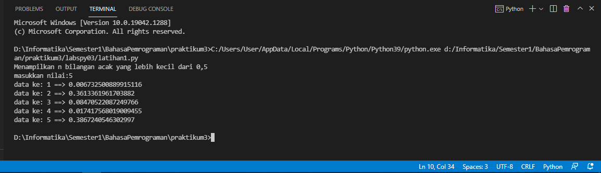
## latihan2
### Buat program untuk menampilkan bilangan terbesar dari n buah data yang diinputkan. Masukkan angka 0 untuk berhenti
Buatlah program seperti berikut ini:
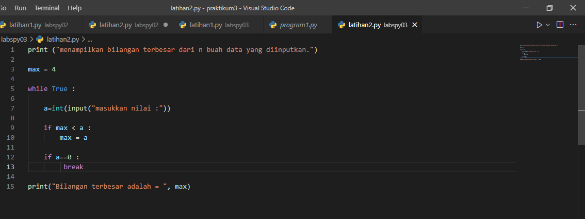
Running prorgram dan hasilnya akan seperti dibawah ini:
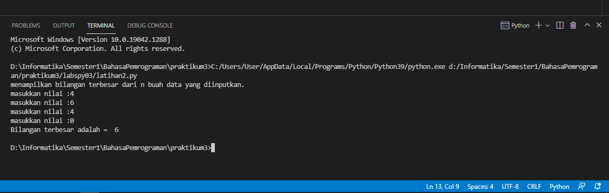

## tugas Program1
### Menghitung laba
##### x=100000000 modal 100.000.000, variabel x.
##### sum=0 variabel untuk menjumlah total laba.
##### y=0 variabel untuk masa bulan.
##### laba = [int(0), int(0), int(a) * .1, int(a) * .1, int(a) * .5, int(a) * .5, int(a) * .5, int(a) * .2] variabel untuk jumlah laba perbulan, dipisahkan dengan koma dan tipe data integer.
##### for i in lb : looping for index i dengan mengambil data dari laba.
##### sum=sum+i rumus untuk menghitung total laba perbulan.
##### y+=1 masa bulan, tiap looping menambah 1.
##### print('Laba Bulan Ke-', y ,'Sebesar :',y) print : y = ambil masa bulan, i = ambil dari data yang ada di dalam lb.
##### print('TOTAL LABA YANG DI DAPAT ADALAH :',sum) print total laba
berikut ini adalah programnya:
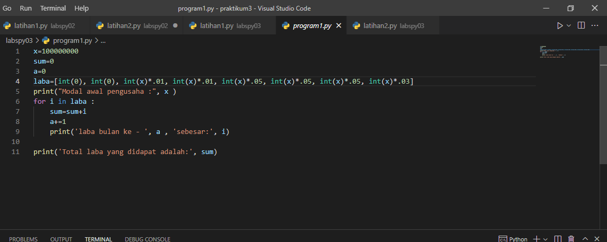
Dibawah ini adalah hasilnya:
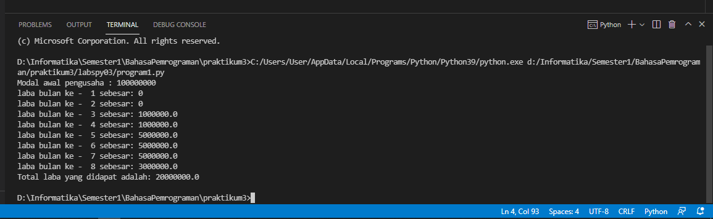

# Selesai